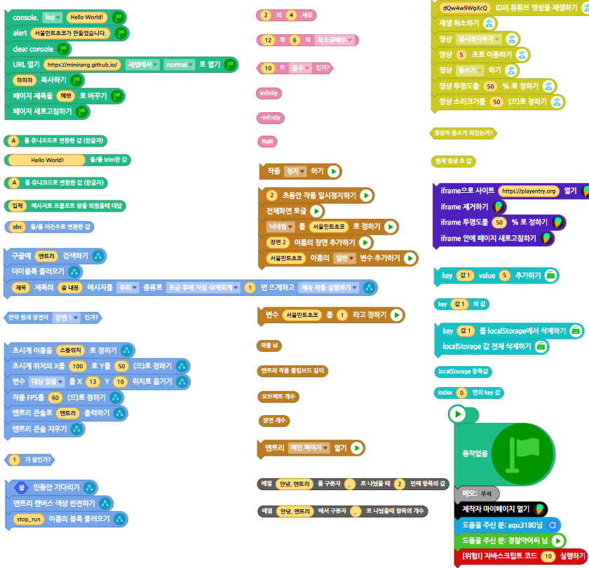

# 🍀MintBlock
서울민트초코가 만든 엔트리 비공식 블록
<br><br>
엔트리 비공식 블록 최초 영상 기능 지원, 거의 모든 블록 정상 작동
<br><br>
아마 엔트리에서 2번째로 비공식 블록중에 작동되는 블록이 가장 많을겁니다.
<br><br>
사용법: 
1. 엔트리 작품만들기 페이지
2. F12 ==> 콘솔
3. 복사 붙여넣기 (붙여넣기가 안된다면 '붙여넣기 허용'이나 'allow pasting' 입력)
```javascript
$.get('https://raw.githack.com/minirang/MintBlock/main/block.js')
```

조금이라도 더 안전한 버전을 쓰고 싶다면 
```javascript
$.get('https://raw.githack.com/minirang/MintBlock/main/safe_mintBlock.js')
```

---
<br>
참고로 스페셜 블록을 아주 일부 참고했습니다.
<br>
또한 경찰악어님의 노팁에서 더미블록 불러오기 코드 퍼왔습니다.
<br><br>
소스 코드는 마음껏 참고해도 되나, 똑같이 따라 하는 것은 허용되지 않습니다.
<br><br>
코드 자체는 자바스크립트 코드 실행 블록에 있는 eval을 제외하면 모두 안전합니다.
버그는 신속히 제보 바랍니다.
<br><br>
단순 재미로만 사용해주시고, 
절대로 악용하지 말아주세요.
<br><br>


---


